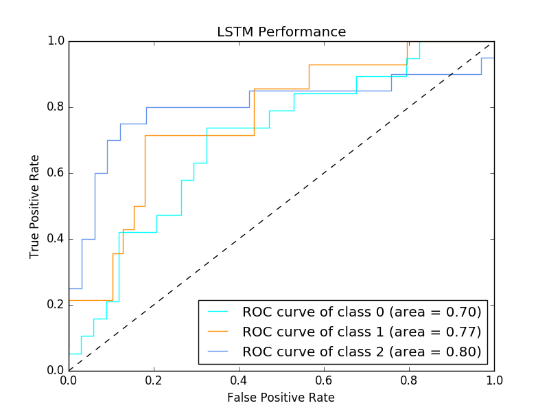
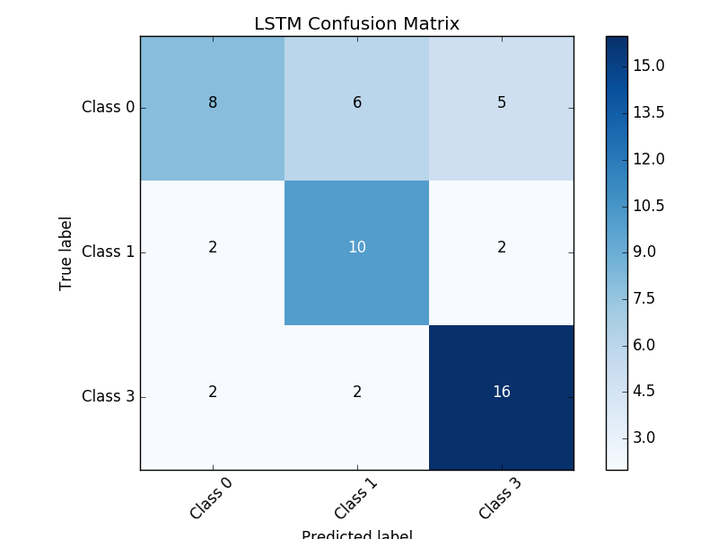

# Multivariate-Classification
Multivariate Time Series  Classification Using LSTM

### Multivariate Time Series Classification using LSTM - Keras 

**How to Run:** Place `Task1.py`,`Task2.py` and `parsing.py` in `final_data` folder and run. The folder should contain `contourfiles` and `dicom`. `train.csv` is the generated output after Task1.
**dataset Stats:**
`Multi-variate-Time-series-Data.xlsx`
- Total Number of Time Series : 205
- Data For Training :  155
- Data For Validation : 25
- Data For Testing : 25

**Overview :** I have created two classes
- Patient class: containing dicom_folder, label_folded and  scans
- scan class: containing (dicom, label)
 **Why?**
 - Patient level train, validation and test split can be easily done.(Very required)
 - scan: Clubbing dicom and ground truth  together will cause less error.
 - We can perform operations such as `generate_mask()` at scan level by just adding a method.
 - Any Further Operations can be easily integrated at scan level and patient level
 
 **Output:**
generates a train.csv in same folder containg `dicom_path, groundtruth_path`

1. Performance of model on `train set`,

Train ROC             |  Train Confusion matrix
:-------------------------:|:-------------------------:
  |  

2. Performance of model on `test set`,

Test ROC             |  Test Confusion matrix
:-------------------------:|:-------------------------:
  |  

**Results**

**Experimnet setting**
Since task 1 has been done at both patient level and scan level. Task 2 became easy.
1. I just iterated over `num_epochs` and `each_batch` and loaded `X,Y` as numpy array of `[batch_size,height,width,channels]` as specified.
 2. If I had more time, I would have tried unit test. After talking to you I am motivated to learn robust test driven coding.
 
 **Enhancements:** It would be good to know what's the model architecture to make the pipeline more relavent.
 
